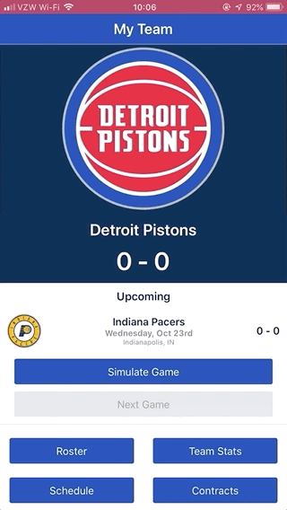

# [Minimum Viable Product] - Basketball GM
## Timespan: 48 hours

> **Disclaimer** 
> 
> All images are property of the National Basketball Association (NBA). This project is strictly for personal use and not meant to be monetized. No copyright infringement intended. 

## Technologies Used


## Table of Contents

1. [Description](#description)
2. [Screens](#screens)
3. [Building and Running](#building-and-running)
4. [Timelog](#timelog)

### Description

> Basketball GM is meant to be an application where YOU are the general manager of a professional basketball team, controlling its day to day logistics and overseeing its success. 
> 
> This project represents a "minimum viable product" created within the span of 48 hours. The total time spent on this project was 22 hours and 39 mins. 
> 
> **Current functionality of the application:** 
> - View all teams by conference
> - View a single team's roster, schedule (10 games), past season statistics, and player contracts
> - Simulate one game at a time, up to 10 upcoming games
> 
> **Planned/Upcoming Features:**
> - Select a franchise from over 30 unique teams
> - Trade and draft players across multiple 
> - Sign up/ Sign in to save your league
> - Simulate games more accurately based on the team and player stats
> - Improve player stats with training programs
> - And more...
> 
> **Technology:**
> - Created entirely using React Native and React Native Elements
> - Designed with React Native Extended Stylesheet
> - Built using XCode to built-in iOS simulator

### Screens

|                                    Home Screen                                    |                                      Team Selector                                      |
| :-------------------------------------------------------------------------------: | :-------------------------------------------------------------------------------------: |
|  |  |

|                                     Team Details                                      |                                   Simulate / Next Game                                   |
| :-----------------------------------------------------------------------------------: | :--------------------------------------------------------------------------------------: |
|  |  |

|                                        Roster                                        |                                          Stats                                          |
| :----------------------------------------------------------------------------------: | :-------------------------------------------------------------------------------------: |
|  |  |

|                                        Schedule                                        |                                        Contracts                                        |
| :------------------------------------------------------------------------------------: | :-------------------------------------------------------------------------------------: |
|  |  |


### Building and Running

Fork and clone the repository

```sh
git clone https://github.com/sintur2527/basketballGM.git
cd basketballGM
```
Install node dependencies
```sh
npm install
```
Install
[React Native CLI](https://facebook.github.io/react-native/docs/getting-started.html)
```sh
npm i -g react-native-cli
```

#### Make sure to have Xcode or Android Studio installed
##### For ios

```sh
react-native run-ios
```
##### For android
```sh
react-native run-android
```

### Timelog

#### Logged with [WakaTime](https://wakatime.com)
 
