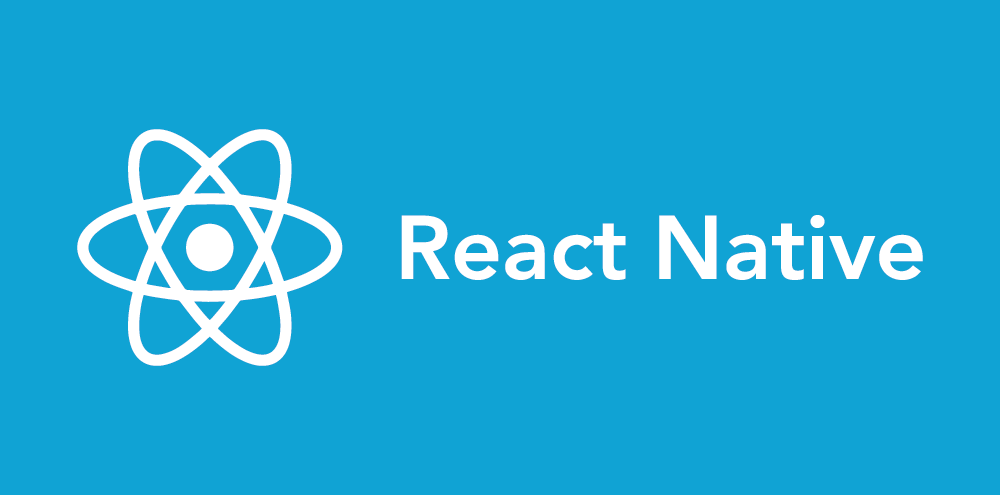
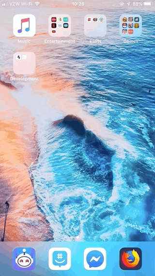
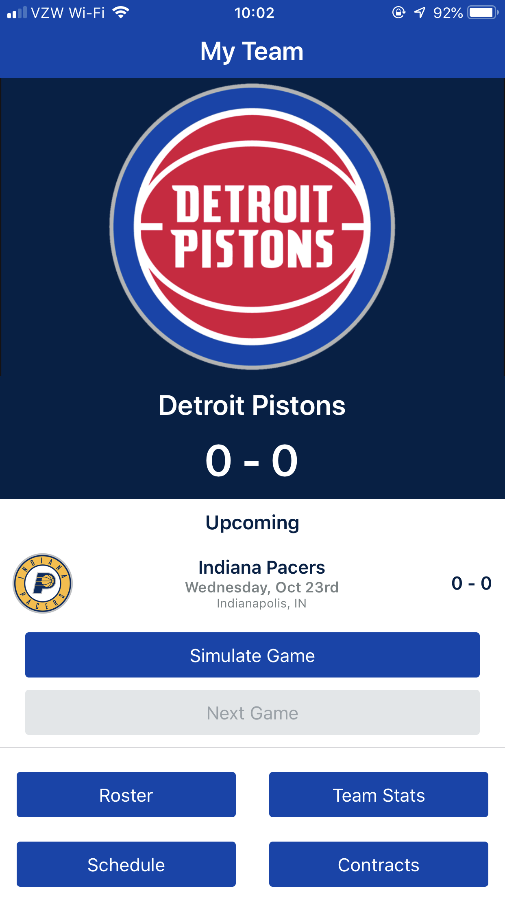

# Basketball GM - "Minimum Viable Product"

### Timespan: 48 hours

## Technologies Used

> Basketball GM is meant to be an app where YOU are the manager of a basketball team, controlling the day to day logistics of the team. 
> - This application represents a minimum viable product, where given a limited timespan, 

## Table of Contents

1. [Screens](#screens)

### Screens

Home Screen

Team Selector

Team Details

Simulate Game / Next Game

Roster

Team Stats

Contracts

Schedule

